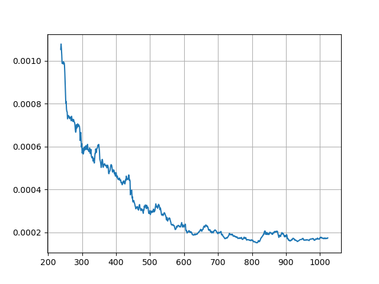

-   [Botlzmann machines](#botlzmann-machines)
    -   [Resources](#resources)
    -   [Comparing ideal and Gibbs-sampled
        distributions](#comparing-ideal-and-gibbs-sampled-distributions)

# Botlzmann machines

## Resources

-   https://medium.com/machine-learning-researcher/boltzmann-machine-c2ce76d94da5
-   https://towardsdatascience.com/restricted-boltzmann-machine-how-to-create-a-recommendation-system-for-movie-review-45599a406deb
-   With MNIST
    https://www.pyimagesearch.com/2014/06/23/applying-deep-learning-rbm-mnist-using-python/

## Comparing ideal and Gibbs-sampled distributions

Calculating the Gibbs distribution in a brute-force manner

``` python
def tPideal(t:Task,T:float=1)->PDist:
  sz=tisize(t)
  assert sz<=10, f"Are you crazy?"
  Z=0.0
  ps=np.zeros(2**sz)
  for i in range(2**sz):
    v=np.array([(1 if b>0 else -1) for b in i2bits(i,nbits=sz)])
    p=exp(-tenergy(t,v)/T)
    Z+=p
    ps[i]=p
  return mkpdist(ps/Z)
```

Callculating an approximation to the same Gibbs distribution using Gibbs
sampler.

``` python
def gibbsPI(t:Task, T:float=1.0, maxsteps:Optional[int]=100)->Iterator[PDist]:
  sz=tisize(t)
  v=np.zeros(shape=(sz,),dtype=int)
  step=0
  ps=np.zeros(2**sz)
  while True:
    if maxsteps is not None and step>=maxsteps:
      break
    for j in range(sz):
      s=0
      for i in range(sz):
        if i!=j:
          s+=t.weights[i,j]*v[i]
      P1=sigmoid((2/T)*s)
      v[j]=np_choice([1,-1],p=[P1,1.0-P1])
    ps[vstamp(v)]+=1
    step+=1
    if step%100==0:
      yield mkpdist(ps/step)
```

Comparing the results using KL-divergence

``` python
@autostage(name='plotKL',T=1.0,out=[selfref,'out.png'],
           sourcedeps=[gibbsPI, tPideal])
def stage_plotKL(build:Build,name,reft,out,T=1.0):
  t=tload(reft.out)
  pd1=tPideal(t,T)
  acc=[]
  for pd2 in gibbsPI(t,T,maxsteps=100*1024):
    kl=KL(pd1.pdf,pd2.pdf)
    acc.append(kl)
  plt.close()
  plt.style.use('default')
  plt.plot(acc,label='KL-dvg')
  plt.grid()
  plt.savefig(out)
```


