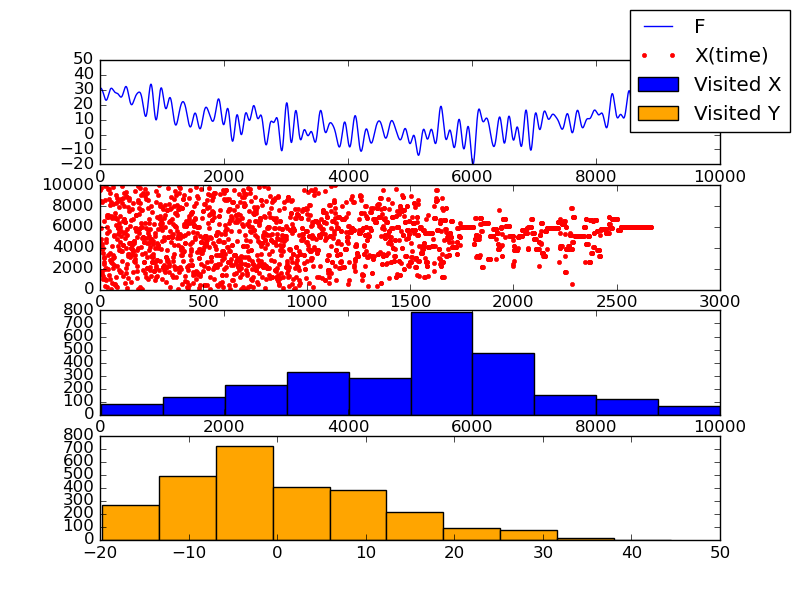
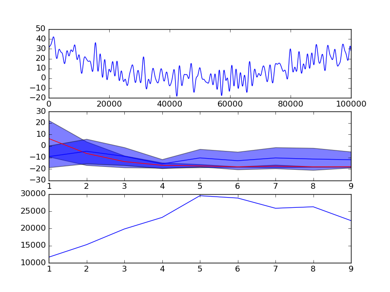

-   [Annealing, single run](#annealing-single-run)
-   [Annealing, dimentionality test](#annealing-dimentionality-test)
    -   [Smaller task](#smaller-task)
    -   [Larger task](#larger-task)
    -   [Even larger task](#even-larger-task)

``` python
def metropolis(F:Callable[[V],float],
               G:Callable[[V],V],
               T:float,
               X_0:V,
               maxsteps:Optional[int]=100,
               maxaccepts:Optional[int]=None)->MetropolisResults[V]:
  """ Find the minimum of `F` using the MCMC algorithm. Evolve the F's argument
  according to the `MC` step function """
  step=0
  naccepts=0
  X=X_0
  Y=F(X)
  Xs=[]; Ys=[]; Ps=[]; Ac=[]
  while True:
    if maxsteps is not None and step>=maxsteps:
      break
    if maxaccepts is not None and naccepts>=maxaccepts:
      break
    X2=G(X)
    Y2=F(X2)
    if Y2<Y:
      Ps.append(1.0)
    else:
      Ps.append(exp((Y-Y2)/T))
    assert Ps[-1]>=0.0
    assert Ps[-1]<=1.0
    accept=np_choice([True,False],p=[Ps[-1],1.0-Ps[-1]])
    if accept:
      X=X2
      Y=Y2
    Xs.append(X)
    Ys.append(Y)
    Ac.append(1 if accept else 0)
    naccepts+=1 if accept else 0
    step+=1
  return MetropolisResults(Xs,Ys,Ps,Ac,T)
```

## Annealing, single run

len(Xs)=2771 Result: X=5900 Y=-15.470267369982917 

## Annealing, dimentionality test

The algorithm:

1.  Generate a random “sin-smile” function
2.  For dim in \[1..10\] do
    -   Find the minimum of the function `R^dim -> R` be annealing,
        write down the number of steps used.
    -   Search the minimum of the same function using the brute-force
        search with the same number of steps.
    -   Repeat 10 times
3.  Plot the comparison results.

### Smaller task

TASK_SIZE=10000

dim 1 dim 2 dim 3 dim 4 dim 5 dim 6 dim 7 dim 8 dim 9 

### Larger task

TASK_SIZE=100000

dim 1 dim 2 dim 3 dim 4 dim 5 dim 6 dim 7 dim 8 dim 9 

### Even larger task

TASK_SIZE=1000000

dim 1 dim 2 dim 3 dim 4 dim 5 dim 6 dim 7 dim 8 dim 9 
